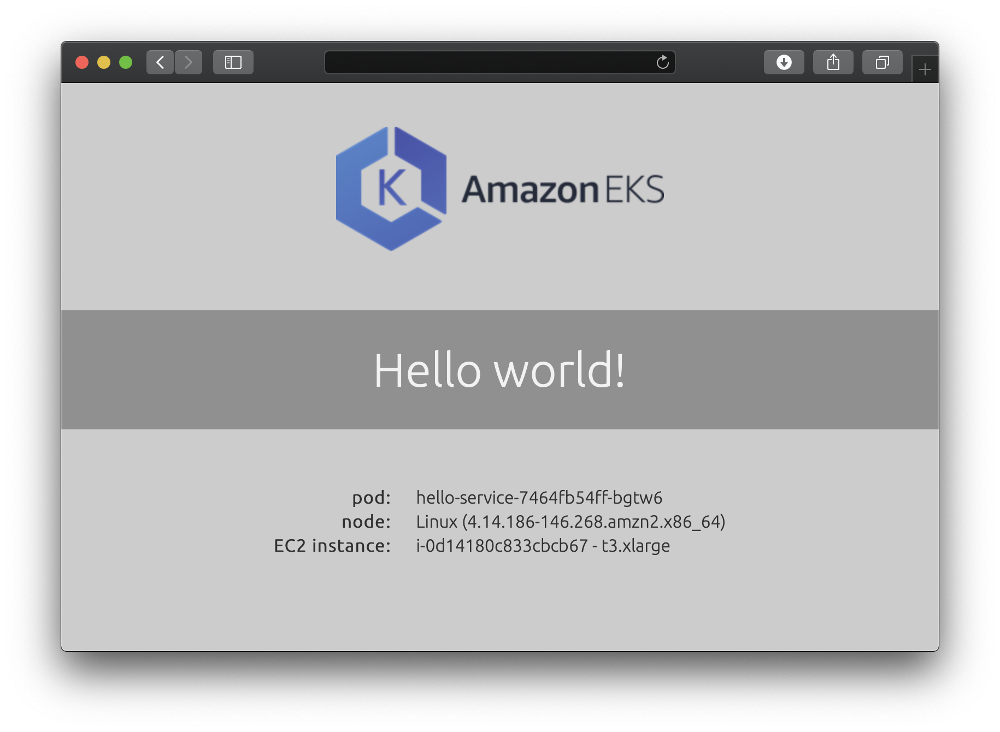

# Hello EKS!

This container image can be deployed on an EKS cluster. When accessed via a web browser on port `8080`, it will display:
- a default **Hello world!** message
- the pod name
- node os information
- EC2 InstanceID and Type



The default "Hello world!" message displayed can be overridden using the `MESSAGE` environment variable. The default port of 8080 can be overriden using the `PORT` environment variable.

## DockerHub

It is available on DockerHub as:

- [marceloboeira/hello-eks:1.0](https://hub.docker.com/r/marceloboeira/hello-eks/)

## Deploy

### Standard Configuration

Deploy to your EKS cluster using the `hello-eks.yaml`, which contains definitions for the service and deployment objects:

```yaml
# hello-eks.yaml
apiVersion: v1
kind: Service
metadata:
  name: hello-eks
spec:
  type: LoadBalancer
  ports:
  - port: 80
    targetPort: 8080
  selector:
    app: hello-eks
---
apiVersion: apps/v1
kind: Deployment
metadata:
  name: hello-eks
spec:
  replicas: 3
  selector:
    matchLabels:
      app: hello-eks
  template:
    metadata:
      labels:
        app: hello-eks
    spec:
      containers:
      - name: hello-eks
        image: marceloboeira/marceloboeira:1.0
        ports:
        - containerPort: 8080
```

```bash
$ kubectl apply -f yaml/hello-eks.yaml
```

This will display a **Hello world!** message when you hit the service endpoint in a browser. You can get the service endpoint ip address by executing the following command and grabbing the returned external ip address value:

```bash
$ kubectl get service hello-eks
```

### Customise Message

You can customise the message displayed by the `hello-eks` container. Deploy using the `hello-eks.custom-message.yaml` file, which contains definitions for the service and deployment objects.

In the definition for the deployment, add an `env` variable with the name of `MESSAGE`. The value you provide will be displayed as the custom message.

```yaml
# hello-eks.custom-message.yaml
apiVersion: v1
kind: Service
metadata:
  name: hello-eks-custom
spec:
  type: LoadBalancer
  ports:
  - port: 80
    targetPort: 8080
  selector:
    app: hello-eks-custom
---
apiVersion: apps/v1
kind: Deployment
metadata:
  name: hello-eks-custom
spec:
  replicas: 3
  selector:
    matchLabels:
      app: hello-eks-custom
  template:
    metadata:
      labels:
        app: hello-eks-custom
    spec:
      containers:
      - name: hello-eks
        image: marceloboeira/hello-eks:1.0
        ports:
        - containerPort: 8080
        env:
        - name: MESSAGE
          value: I just deployed this on EKS!
```

```bash
$ kubectl apply -f yaml/hello-eks.custom-message.yaml
```

### Specify Custom Port

By default, the `hello-eks` app listens on port `8080`. If you have a requirement for the app to listen on another port, you can specify the port via an env variable with the name of PORT. Remember to also update the `containers.ports.containerPort` value to match.

Here is an example:

```yaml
apiVersion: apps/v1
kind: Deployment
metadata:
  name: hello-eks-custom
spec:
  replicas: 3
  selector:
    matchLabels:
      app: hello-eks-custom
  template:
    metadata:
      labels:
        app: hello-eks-custom
    spec:
      containers:
      - name: hello-eks
        image: marceloboeira/hello-eks:1.0
        ports:
        - containerPort: 80
        env:
        - name: PORT
          value: "80"
```


## Build Container Image

If you'd like to build the image yourself, then you can do so as follows. The `build-arg` parameters provides metadata as defined in [OCI image spec annotations](https://github.com/opencontainers/image-spec/blob/master/annotations.md).

```bash
make build
make push
```
